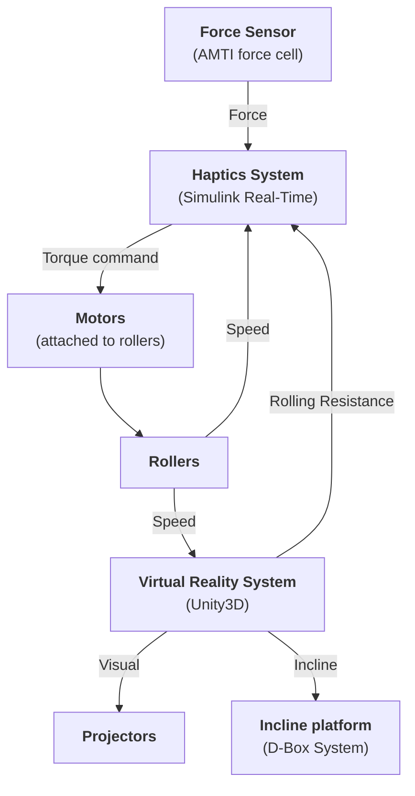

# Hardware overview

The WheelSims system combines:

- **Haptics** - so that the user feels realistic forces at the wheels
- **Virtual Reality** - so that the user feels where they navigate
- **Incline Platform** - so that the user feels the difference between ascending, descending or crossing a slope.

These three systems are independent. For example, it is not required to have an haptic system to navigate in virtual reality. They are complementary, they add realism to the simulation.

This figure illustrates the data flow between the different systems:

