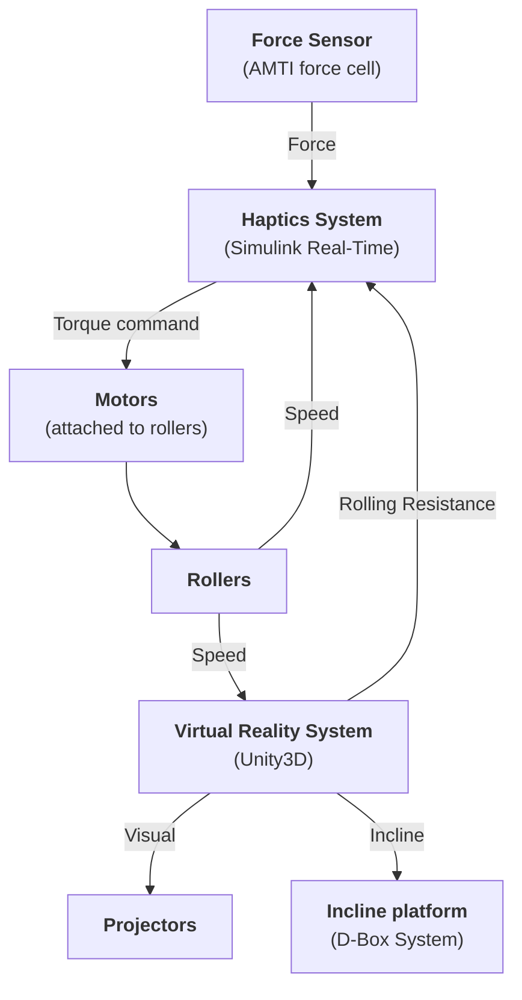

# Overview

The WheelSims project is a set of blocks distributed on different repositories, that can be shared among wheelchair simulators to accelerate the development of virtual reality in wheelchair training.

## Hardware overview

The WheelSims system combines:

- **Haptics** - so that the user feels realistic forces at the wheels
- **Virtual Reality** - so that the user feels where they navigate
- **Incline Platform** - so that the user feels the difference between ascending, descending or crossing a slope.

These three systems are independent. For example, it is not required to have an haptic system to navigate in virtual reality. They are complementary, they add realism to the simulation.

This figure illustrates the data flow between the different systems:

## Software overview

The project uses a git-based versioning system, with heavy use of git submodules. All toplevel repositories start with `sim_`:

- [`sim_generic`](https://github.com/WheelSims/sim_generic): A generic repository not tied to specific hardware. This "simulator" includes every available submodule and is mainly for testing and developing the submodules.
- [`sim_irglm`](https://github.com/WheelSims/sim_irglm): The IRGLM high-realism simulator.
- [`sim_racing`](https://github.com/WheelSims/sim_racing): A wheelchair racing simulator with user-power biofeedback.

New simulators normally use [`sim_generic`](https://github.com/WheelSims/sim_generic) as a template, which folder/submodule hierarchy is presented below.

- `Unity`
  - `Assets`
    - [`vr_assets_common`](https://github.com/WheelSims/vr_assets_common): A git submodule that includes all shared objects and scripts, from the smallest object to whole environments, available as drag-drop prefabs.
    - `Scenes`: A folder that includes the specific scenes for a given simulator. A scene normally consists in at least an environment from the [vr_assets_common](https://github.com/WheelSims/vr_assets_common), and a user from the User folder.
    - `User`: A folder that includes a set of colliders, cameras and scripts that represents the user in its environment. This also includes scripts to communicate with the haptics system (if present), the incline system (if present), and other instruments.
  - [`vr_art_source`](https://github.com/WheelSims/vr_art_source): A git submodule of construction material for the assets and scenes, such as Blender files. This repository does not contain the textures: textures are in the [vr_assets_common](https://github.com/WheelSims/vr_assets_common) so that they are read by Unity.
  - `Library`
  - `Packages`
  - ...
 
- `Haptics`
  - [`haptics_common`](https://github.com/WheelSims/haptics_common): A git submodule of Simulink blocks that are shared between simulators, such as the dynamical model of a wheelchair, motor controllers, etc.
  - ...
