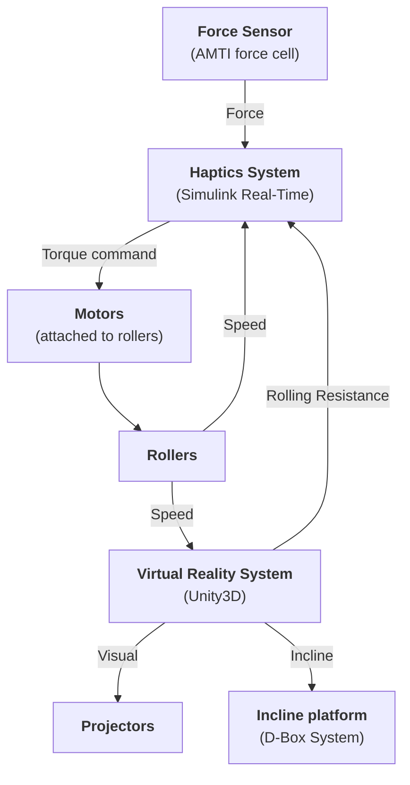
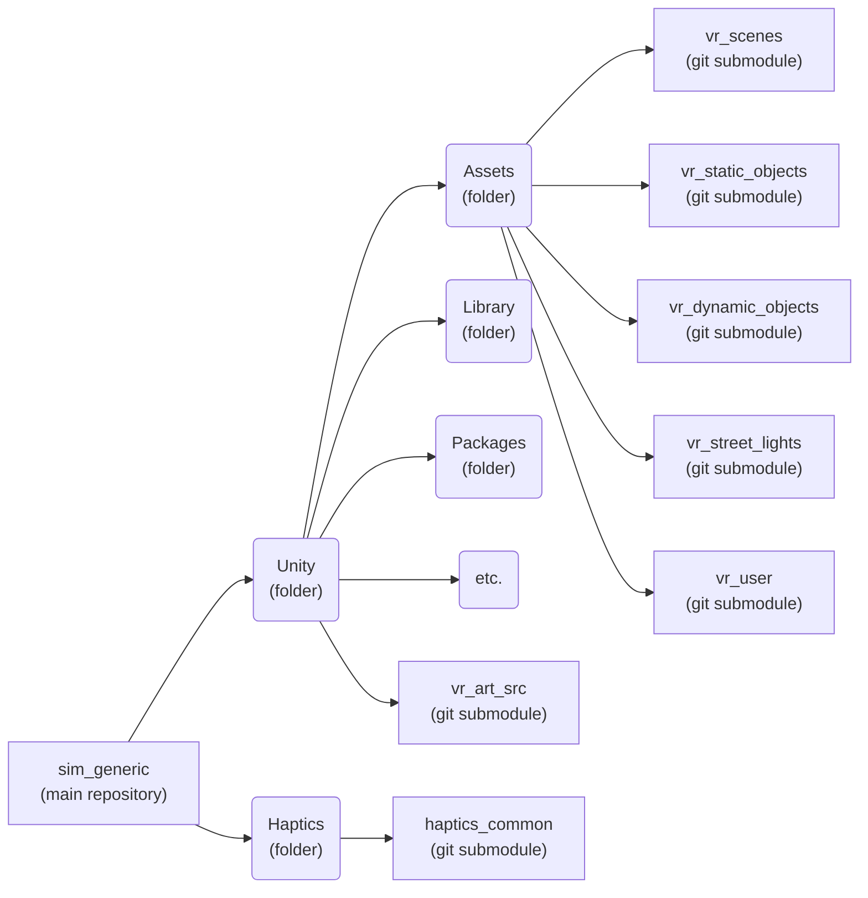

# Overview

The WheelSims system combines:

- haptics - so that the user feels realistic forces at the wheels
- virtual reality - so that the user feels where they navigate
- an incline platform - so that the user feels the difference between ascending, descending or crossing a slope.

These three systems are independent. For example, it is not required to have an haptic system to navigate in virtual reality. They are complementary, they add realism to the simulation.

This figure illustrates the data flow between the different systems:

The project uses a git-based versioning system, with heavy use of git submodules. Any simulator is derived from the `sim_generic` repository, which is a toplevel repository that includes every available submodule. The folder/submodule hierarchy in this repository is:

with:

- `Unity` folder: The Unity project to open in Unity Hub. Apart from the git submodules, the contents of this folder is specific to this simulator.
- `Assets` folder: A folder that contains the asset submodules, shared between every simulators.
- `vr_scenes` submodule: An asset submodule that includes all available scenes.
- `vr_static_objects` submodule: An asset submodule that includes static objects such as bins, trees, building facades, etc.
- `vr_dynamic_objects` submodule: An asset submodule that includes dynamic objects such as pedestrians and cars.
- `vr_street_lights` submodule: An asset submodule that includes automated, configurable street lights, streets and sidewalks.
- `vr_user` submodule: An asset submodule that includes a set of colliders, cameras and scripts that represents the user in its environment. This also includes code to communicate with the haptics system (if present) and the incline system (if present).
- `vr_art_src` submodule: A repository of construction material for the assets and scenes, such as Blender files.
- `Haptics` folder: A folder that contains the Simulink Real-Time material for the haptics system. Apart from the git submodule, the contents of this folder is specific to this simulator.
- `haptics_common` submodule: A submodule of Simulink blocks that are shared between simulators, such as the dynamical model of a wheelchair, motor controllers, etc.

