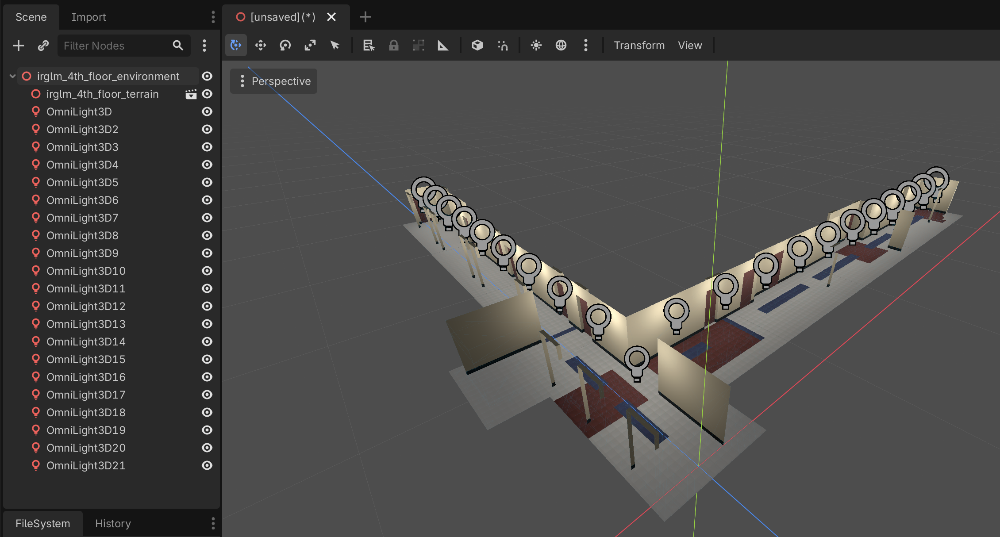
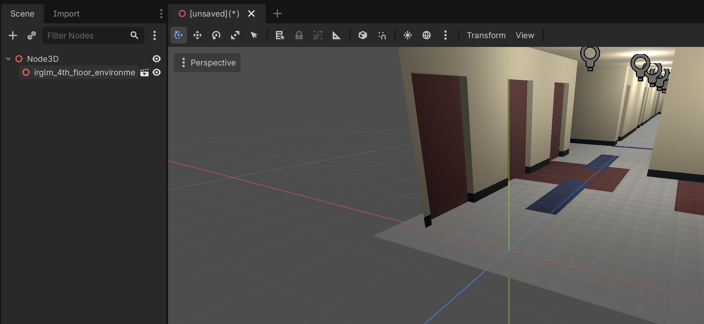
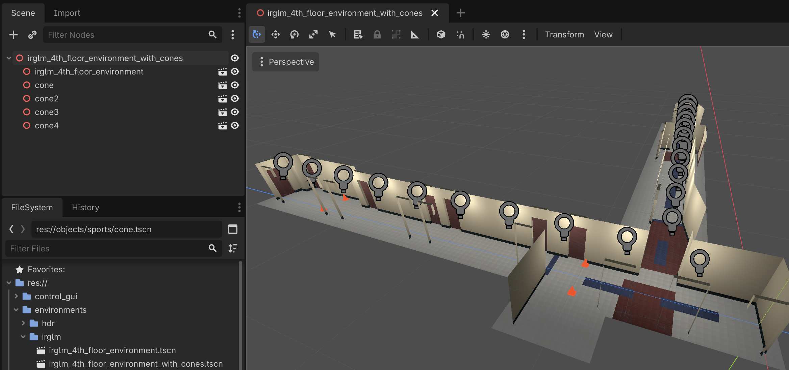

# Developing new environments

An environment is the combination of a terrain (which includes the ground and walls geometry and collision shapes), and of different objects such as lights, visual elements and obstacles. In this tutorial, we will create an environment that adds lighting to the `irglm_4th_floor_terrain` terrain that we created [here](developing_new_terrains.md) so that it becomes navigable.

Before creating the new environment, we create the folder `res://environments/irglm` that will contain all environments related to the IRGLM.

## Creating the environment scene in Godot

We close all scenes and we create a new 3D Scene:

Then, from the FileSystem view, we drag and drop the `irglm_4th_floor_terrain.tscn` file that we built [previously](developing_new_terrains.md) onto the root Node3D that we just created.

We will now add some lighting, then we rename the Node3D to `irglm_4th_floor_environment`. Note that we deselected these buttons from the 3D view toolbar, to preview the lightning in the 3D view:

We save it using the same name as `res://environments/irglm/irglm_4th_floor_environment.tscn` folder.

## Adding objects to an environment

We just created a minimally viable environment that includes the terrain geometry and some lights. We can then use this minimal environment as the basis for more advanced environments that contains objects. Here, we will create the new `irglm_4th_floor_with_cones` environment that adds several `cone` objects that we created [here](developing_new_static_objects.md).

We start over again by creating a new 3D scene:

and then we drag the `irglm_4th_floor_environment.tscn` scene that we just created into the root Node3D.

We do the same multiple times with the `cone.tscn` we built [previously](developing_new_static_objects.md).

We then reposition the codes, rename the Node3D node to `irglm_4th_floor_environment_with_cones`, and save it as `res://environments/irglm/irglm_4th_floor_environment_with_cones.tscn`.

Both environments (`irglm_4th_floor_environment.tscn` and `irglm_4th_floor_environment_with_cones.tscn`) are now ready to be included in a playable scene according for the need of cones or not.
