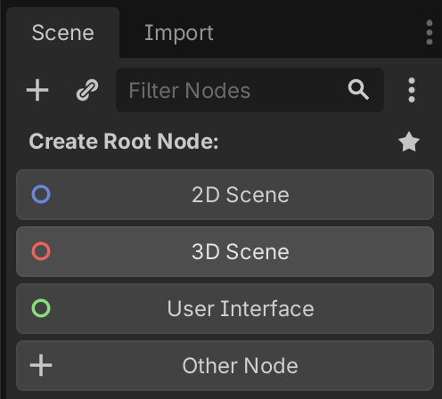
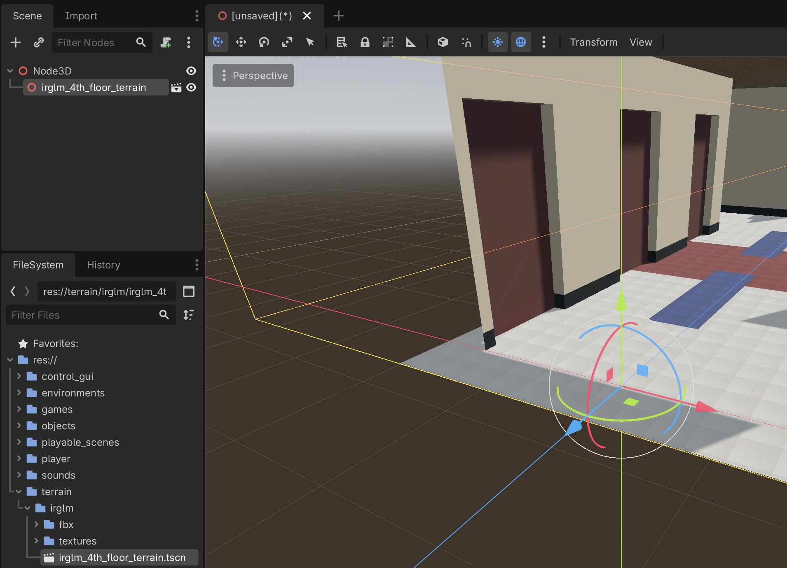
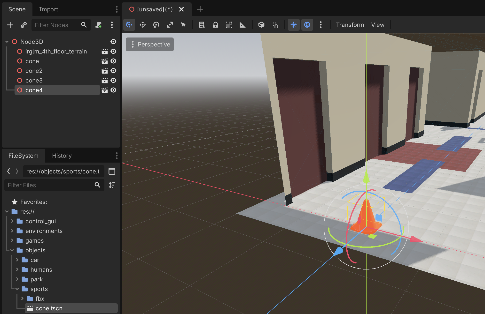
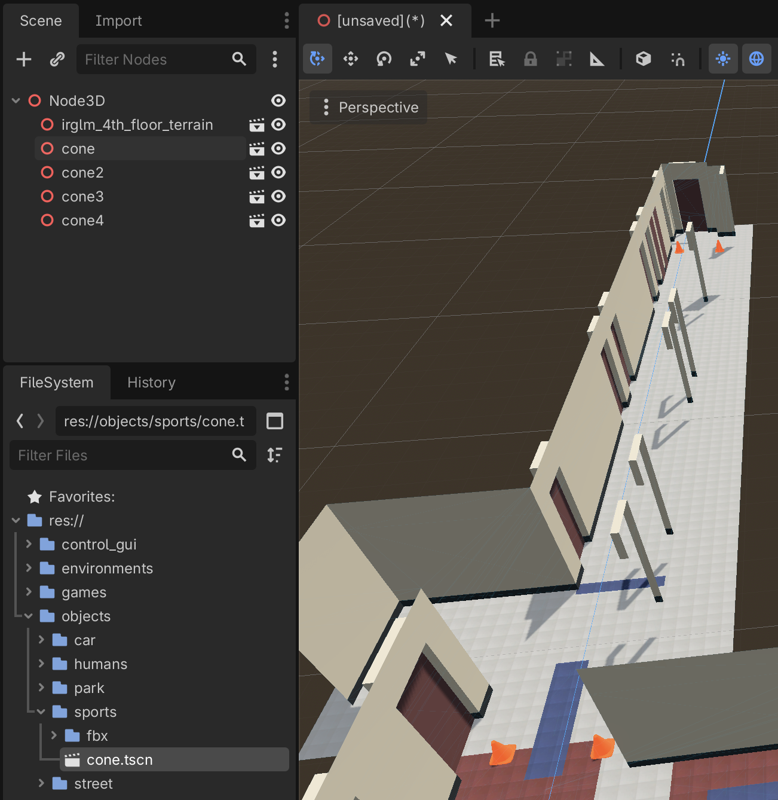

# Developing new environments

An environment is the combination of a terrain (which includes the ground and walls), and of different objects. In this tutorial, we will create an environment that combines the `irglm_4th_floor_terrain` that we created [here](developing_new_terrains.md), and several `cone` objects that we created [here](developing_new_static_objects.md). This will create the `irglm_4th_floor_environment` environment.

Before creating the new environment, we create the folder `wheelsims/src/environments/irglm` that will contain all environments related to the IRGLM.

## Creating the environment scene in Godot

We close all scenes and we create a new 3D Scene:

Then, from the FileSystem view, we drag and drop the `irglm_4th_floor_terrain.tscn` file that we built [previously](developing_new_terrains.md) onto the root Node3D that we just created.

We do the same multiple times with the `cone.tscn` we built [previously](developing_new_static_objects.md).

Repositioning the cones:

Then we rename the Node3D; here we chose `irglm_4th_floor_environment` but since we could have many environments using a same terrain, then many other names could be used, such as:
- `irglm_4th_floor_with_cones`
- `irglm_4th_floor_straight_line_section`
- etc.

We save it using the same name in the `wheelsims/environments/irglm` folder:

The environment is now ready to be included in a playable scene or game.
