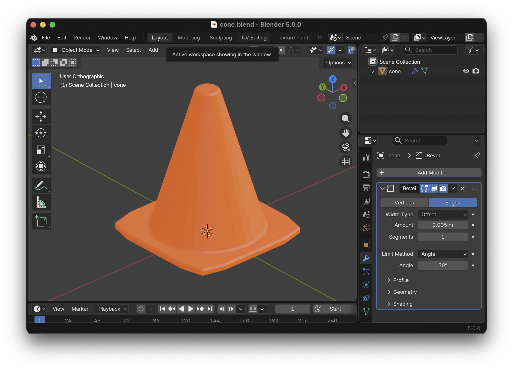
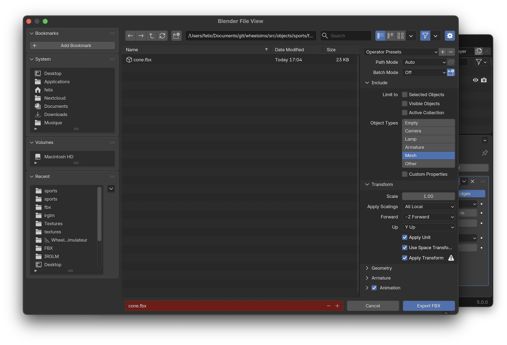
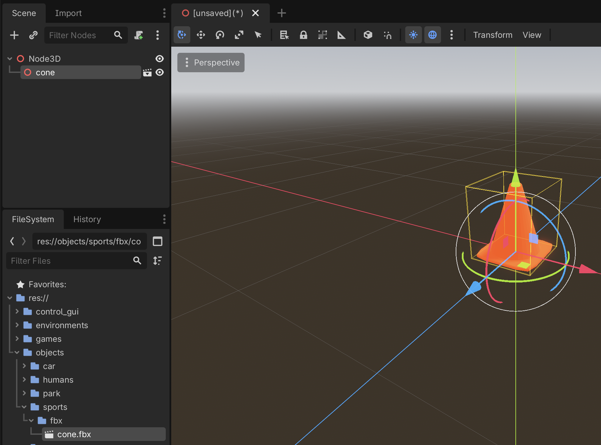
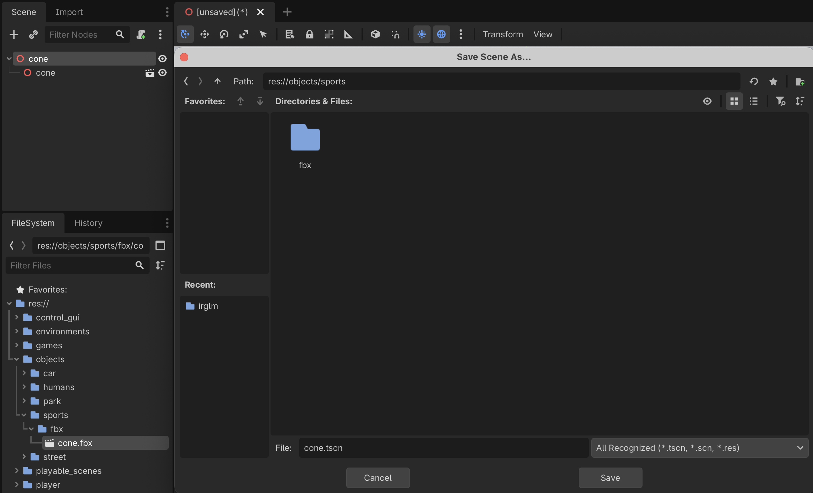
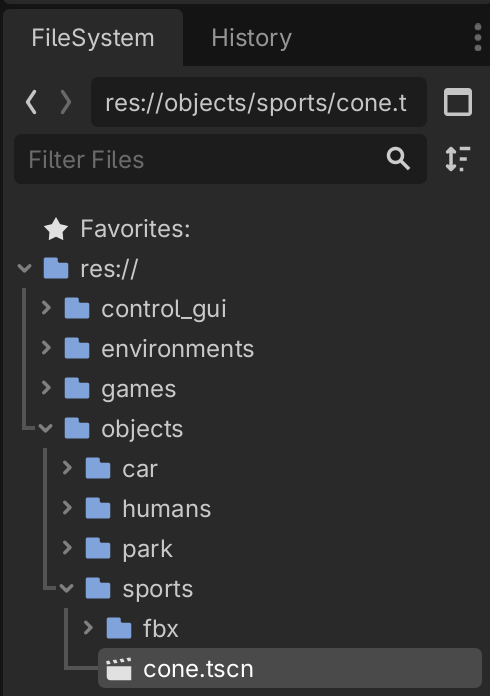
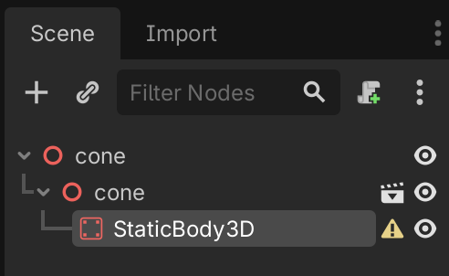
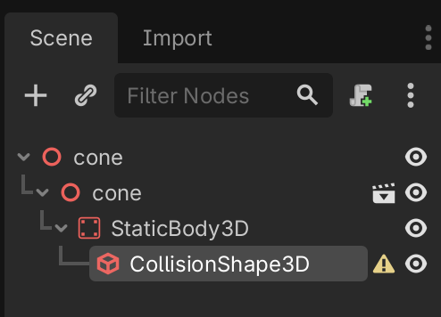
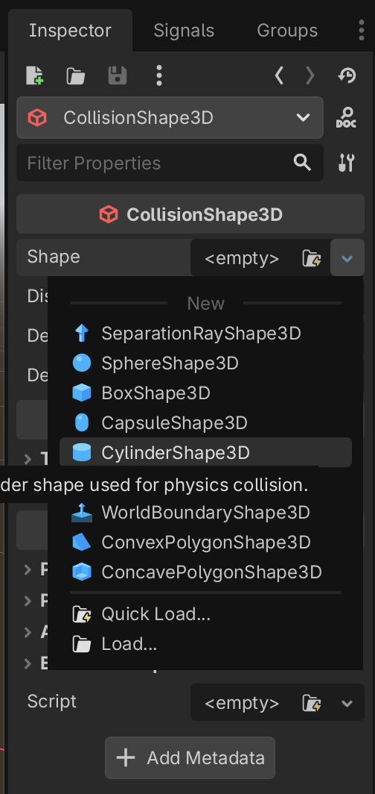
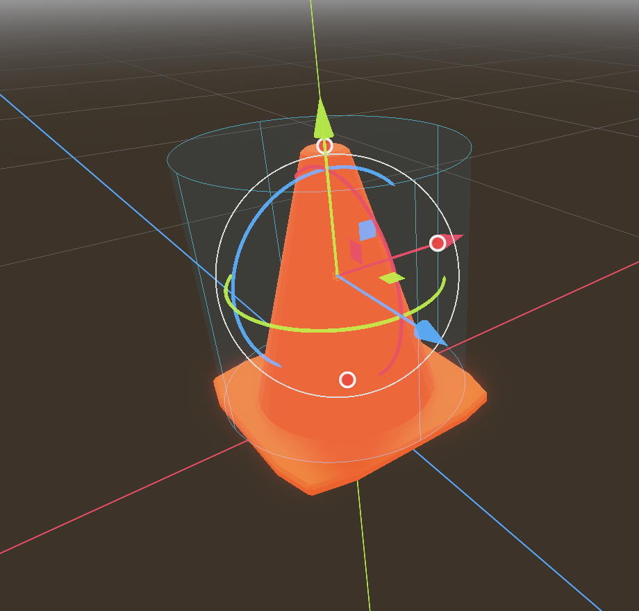

# Developing new static objects

To create an environment in which we may navigate, we first need a [terrain](developing_new_terrains.md), and then we need objects to put on this terrain. In this guide, we will create a static object that is an orange cone.

## Designing the object in Blender

Creating static objects is very similar to [creating terrains](developing_new_terrains.md).

For our cone, we first create there folders:
- `wheelsims/art_source/sports` that will contain the source Blender files for sport-related objects such as our cone;
- `wheelsims/src/objects/sports` that will contain the final object scenes used in Godot;
- `wheelsims/src/objects/sports/fbx` that will contain the exported Blender files;
- `wheelsims/src/objects/sports/textures` that will contain the jpg/png files used as textures (we don't have a texture for our cone, but other objects may have).

We remind that all folder and file names must be in `snake_case` (lower case with words separated by underscores) according to the [file name conventions](conventions.md).

Here is an example of the creation of the `cone` object in Blender, which we save in the `art_source` folder as `wheelsims/art_source/sports/cone.blend`. All units are in meters. For optimization, we try to limit the number of polygon in an object.

If textures are needed, follow the same procedure as for the standard, red and blue tiles in the [terrains tutorial](developing_new_terrains.md).

### Exporting to FBX

Once the object is completed in Blender, we use File → Export → FBX, we select these options, and we save as `wheelsims/src/objects/sports/fbx/cone.fbx`. From this point, the object can be imported into Godot.

## Creating the object scene in Godot

Although we could use the FBX file we just created directly in any scene, we will add an additional layer between the terrain scene (.tscn) used everywhere, and its source geometry (.fbx). This will allow us to add required collision shape to the object later.

In Godot, we close all scenes and we create a new 3D Scene:

Then, from the FileSystem view, we drag and drop the `cone.fbx` file onto the root Node3D that we just created.

We then rename the main node to the same name, and save it in `wheelsims/objects/sports`, again with the same name (`cone.tscn`).

From now on, we can drag the new `cone.tscn` into a scene to use the cone object we just created.

## Setting the collision shape

Although we can include this cone in any scene, we will pass through it and won't collide with it. To make it an obstacle that will stop us in case of collision, we must add a collision shape to it.

In the [terrain tutorial](developing_new_terrains.md), we created trimesh collision shapes using the mesh geometry, which is the best option for complex shapes such as unlevel grounds and walls. However, trimesh collision shapes have a high computational cost and should be avoided for simple objects. A better option is to use primitive shapes such as spheres, cubes and cylinders.

Here, we will create a cylinder around the shape.

We will begin by adding a StaticBody3D to our cone:

Then we add a required CollisionShape3D to the StaticBody3D:

And then, in the inspector with the CollisionShape3D selected, we select a new CylinderShape3D as the shape:

We can match the cylinder to the cone shape using the three red control points:

The cone is now ready to be included in any environment.
