# Developing new terrains

A terrain is a scene that contains (only) the ground and walls. The following guide uses the `irglm_4th_floor` terrain as an example.

## Designing the terrain in Blender

Before creating a new terrain, we create these folders:
- `wheelsims/art_source/irglm` that will contain the source Blender files;
- `wheelsims/src/terrain/irglm` that will contain the final terrain scenes used in Godot;
- `wheelsims/src/terrain/irglm/fbx` that will contain the exported Blender files;
- `wheelsims/src/terrain/irglm/textures` that will contain the jpg/png files used as textures.

We remind that all folder and file names must be in `snake_case` (lower case with words separated by underscores) according to the [file name conventions](conventions.md).

Here is an example of the creation of the `irglm_4th_floor` terrain in Blender. All units are in meters.

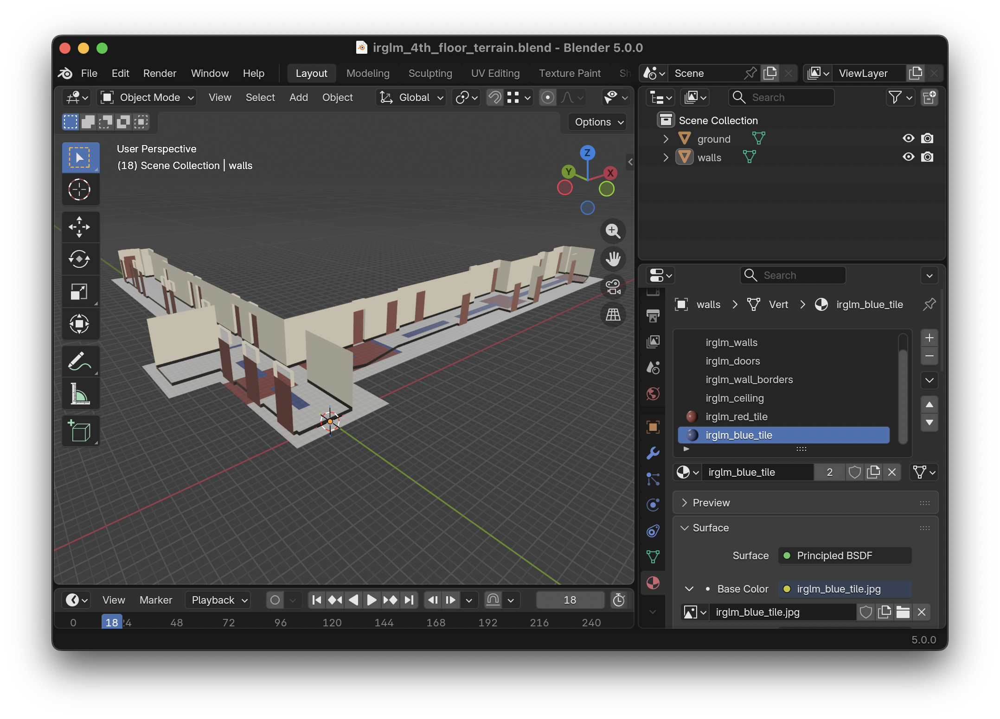

Although the file is saved in the `art_source` folder as `wheelsims/art_source/irglm/irglm_4th_floor_terrain.blend`, the textures must be saved in the `src` folder so that they are imported by Godot. Here we have three textures:
- `wheelsims/src/terrain/irglm/textures/irglm_red_tile.jpg`
- `wheelsims/src/terrain/irglm/textures/irglm_blue_tile.jpg`
- `wheelsims/src/terrain/irglm/textures/irglm_standard_tile.jpg`

### Ground and Walls

In this simple example, we have two separate meshes that we called `ground` and `walls`. It is important to keep the ground and walls separated because once imported into Godot, they will have different behaviours: grounds will be considered as surfaces, and walls will be considered as obstacles.

We can have more meshes that those two; however, having too meshes in the Blender file will add complexity once imported into Godot, and therefore it is advised to keep the number of meshes to the minimum.

### Exporting to FBX

Once the terrain is completed in Blender, we use File → Export → FBX, we select these options, and we saved as `wheelsims/src/terrain/irglm/irglm_4th_floor_terrain.fbx`. From this point, the terrain can be imported into Godot.

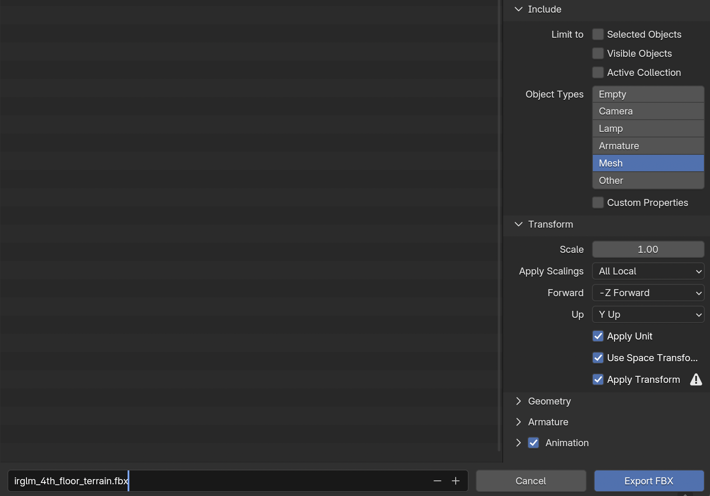

## Creating the terrain scene in Godot

Although we could use the FBX file we just created directly in any scene, we will add an additional layer between the terrain scene (.tscn) used everywhere, and its source geometry (.fbx).

In Godot, we close all scenes and we create a new 3D Scene:

Then, from the FileSystem view, we drag and drop the `irglm_4th_floor_terrain.fbx` file onto the root Node3D that we just created.

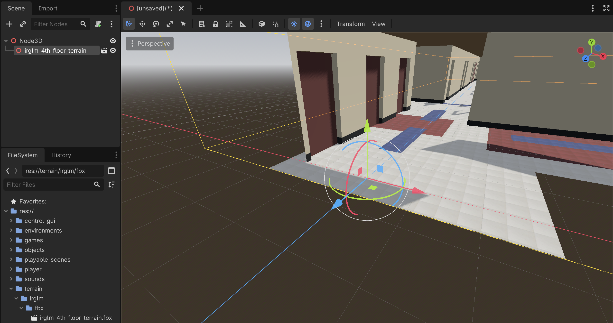

We then rename the main node to the same name, and save it in `wheelsims/terrain/irglm`, again with the same name (`irglm_4th_floor_terrain.tscn`).

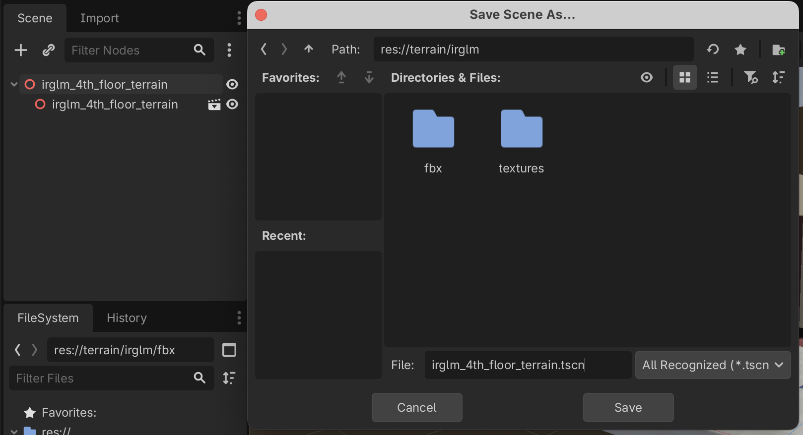

From now on, we can drag the new `irglm_4th_floor_terrain.tscn` into a scene to use the terrain we just created.

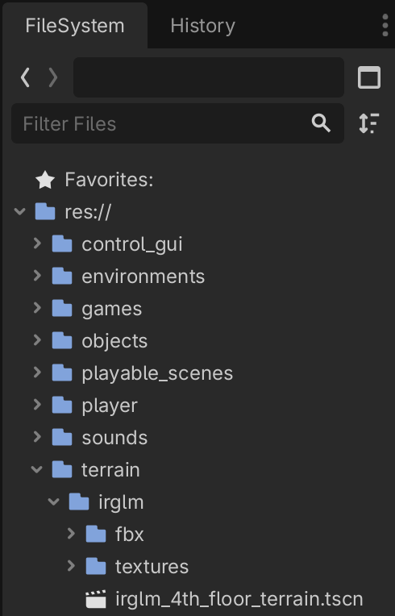

## Setting the colliders

Although we imported the ground and walls correctly, there is still no colliders associated to it, and therefore we would pass through the ground and walls.

To add the colliders, we first right-click on the FBX instance, and we select "Editable Children":

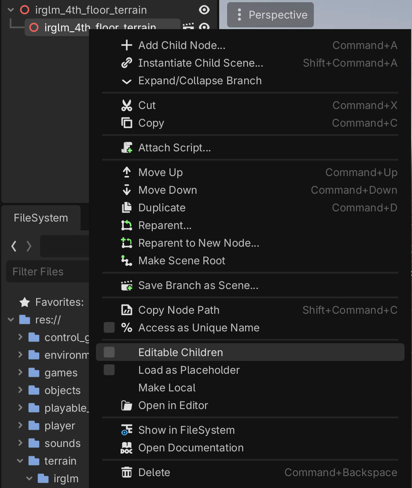

which reveals the different meshes:

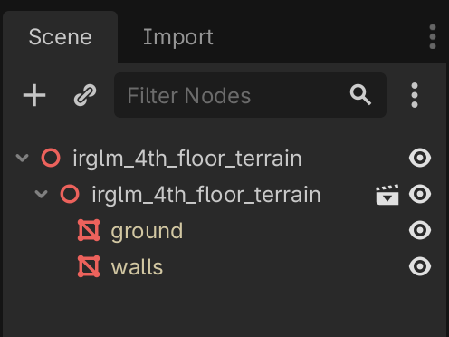

For each mesh, we will create a collision shape. First we select the mesh, then we select "Mesh → Create Collision Shape", and we select "Static Body Child" and "Trimesh".

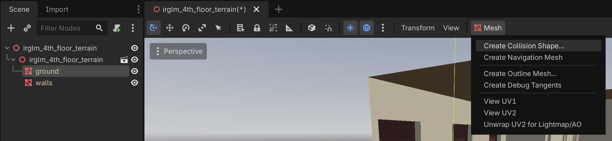

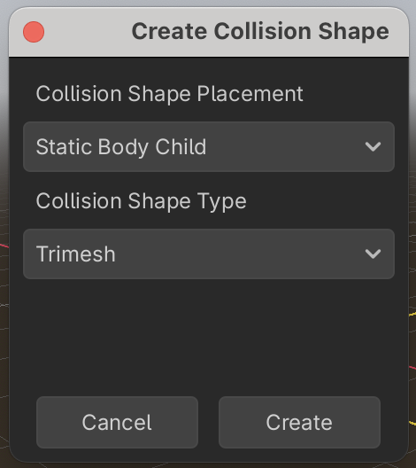

Now, each mesh has an associated collision shape:

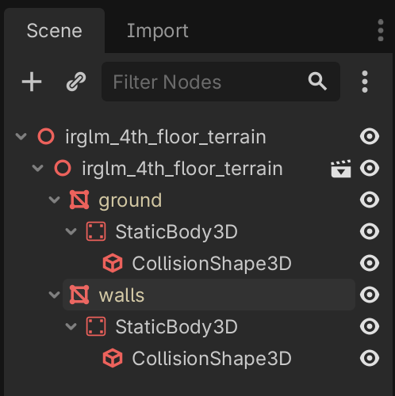

By default, each collision shape is considered as an obstacle. We need to specify that the ground is not an obstacle, but a surface. To this effect, we drag the `surface.gd` script from the `wheelsims/terrain` folder to the StaticBody3D object of the ground.

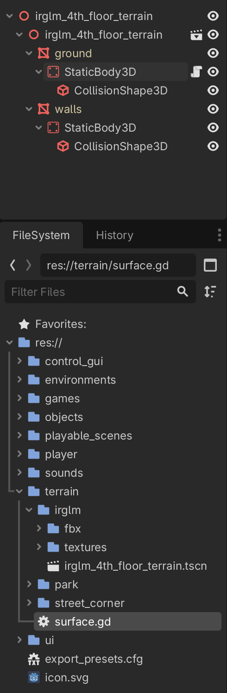

We can now control the rolling resistance (and soon the vibration parameters) of this surface from the inspector:

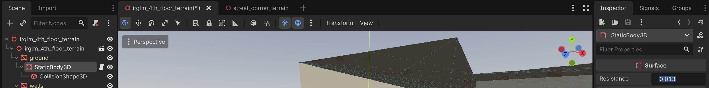

We just save this scene; it is now ready to be included in any environment.
