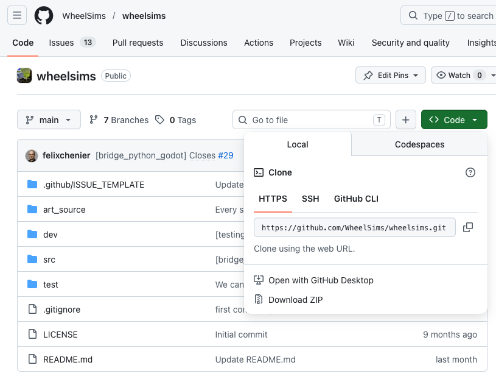
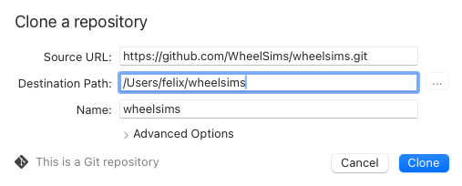

# Cloning  `wheelsims`  for development

If you are part of the lab, you should have direct access to the main `wheelsims` repository. If you are an outside collaborator, then first fork the repository, and follow these steps to clone your fork instead of cloning the main `wheelsims` repository.

We recommend using a desktop git app to ease the development. Here, we show how to use the free [Sourcetree](https://www.sourcetreeapp.com) app to clone the software.

## Get the git URL

You can get the git URL of any project by going on its GitHub repository and by clicking on the green `Code` button:



Here, the git URL is

```
https://github.com/WheelSims/wheelsims.git
```


## In SourceTree, clone a repository from URL, and enter this URL and the local folder where you want to clone




Wait for the clone to complete. This is a pretty large repository and it may take some time.

## Installing webhooks

To add clarity to the sometimes complex git tree, we prepend each commit with the branch name automatically. To do this, open a git-enabled terminal in the local repository's folder. In SourceTree, launch the Terminal:


In the terminal, enter:

```
sh dev/install_git_hooks
```


You are now ready to contribute to the code.
