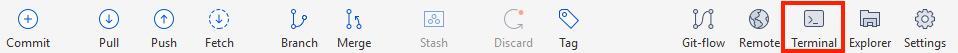

# Cloning vs forking `wheelsims` 

# Installing webhooks

To add clarity to the sometimes complex git tree, we prepend each commit with the branch name. To do this automatically with every commit, you need to follow this method (you only need to do it once).

Open a git-enabled terminal in the local repository's folder. In SourceTree, use the Terminal (3rd icon from the right):



In the terminal, enter:

```
sh dev/install_git_hooks
```

This is it.
