# Creating new characters using Mixamo

This is the procedure to add new characters based on the free Mixamo service from Adobe. Go to https://mixamo.com, create an account and follow these instructions to add new characters to your WheelSims environments.

## Selecting a character

Select a character (here we use Megan) and download as a FBX for Unity with a T-pose. Save it as `External/HumanFBX/HumanName/HumanName.fbx`, e.g., `External/HumanFBX/Megan/Megan.fbx`

The reason why we save it under `External` and not into the `vr_assets_common` repository is that these FBX are free but copyrighted and therefore could not be distributed as part of the WheelSims project.

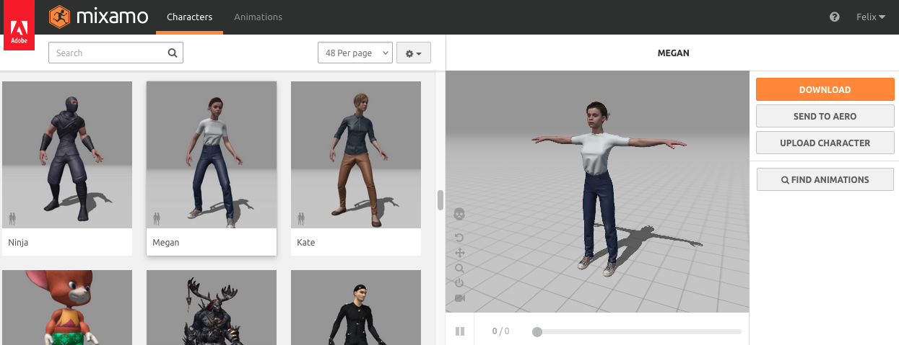

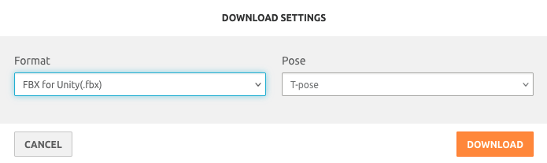

## Applying animations to the character

Repeat these steps for each of these animations:

- Idle
- Walk
- Run
- Walk backward

Find and apply the animation, and optionally tweak its parameters to your liking. For moving animations, check [X] In Place.

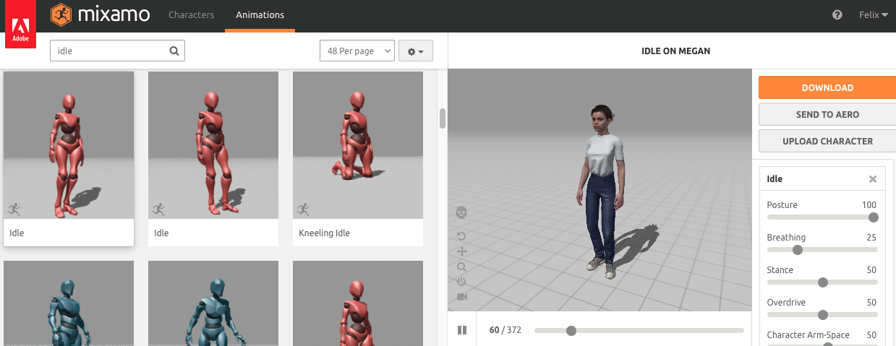

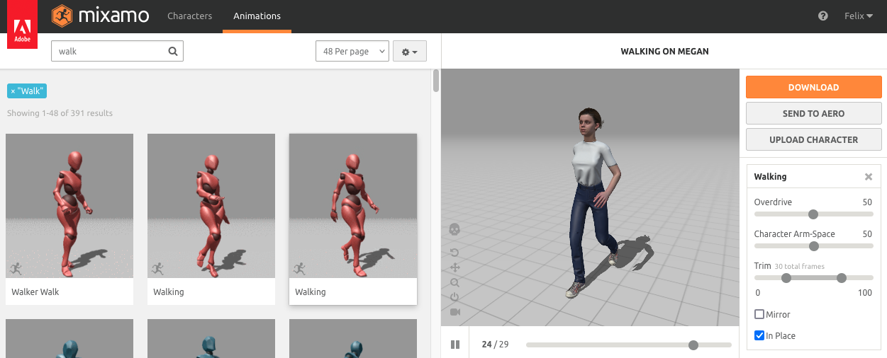

Download the animation without skin. Save it as `External/HumanFBX/HumanName/HumanName@ActionName.fbx`, e.g., `External/HumanFBX/Megan/Megan@idle.fbx`

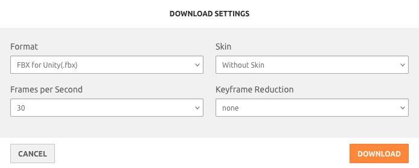

## Importing the character in Unity

Select the first FBX file in Unity (the model in a T-pose, here `Megan.fbx`).

### Importing the model

In the inspector, select these options and apply.

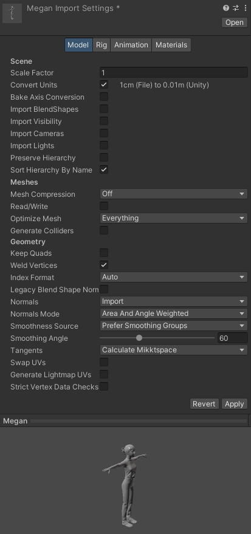

### Importing the rig

In the inspector, select these options and apply.

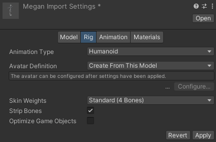

### Importing the materials and textures

In the inspector, go to the Materials pane and extract both the textures and materials.

- Extract the textures to a new folder named `Textures` in the current folder (e.g., `External/HumanFBX/Megan/Textures`).
- Extract the materials to a new folder named `Materials` in the current folder (e.g., `External/HumanFBX/Megan/Materials`).

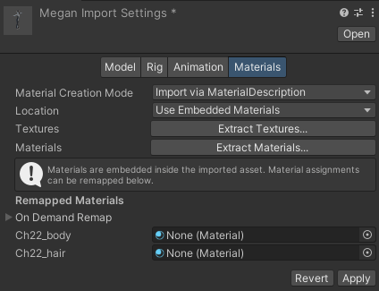

Then apply.

## Importing the animations in Unity

Repeat these steps for each animation:

- Idle
- Walk
- Run
- Walk backward

Start by selecting one animation FBX, for example `Megan@Idle.fbx`.

### Importing the model animation

Use the same settings as previously, then click Apply.

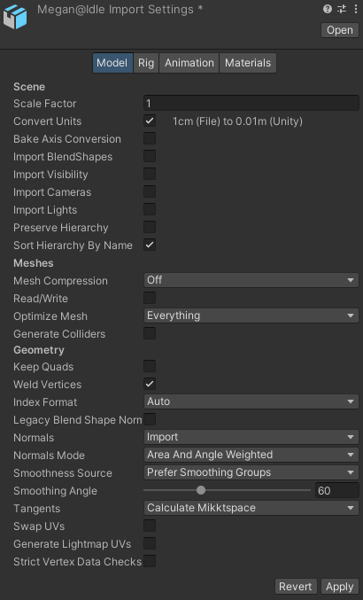

### Applying the rig

We apply the rig from the model avatar (select "Copy From Other Avatar" and select the correct source):

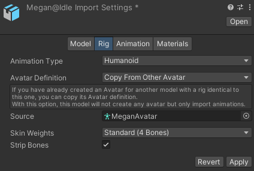

### Importing the animation

Check [X] Loop Time, select Root Transform Position (Y) Based Upon "Feet", and Apply.

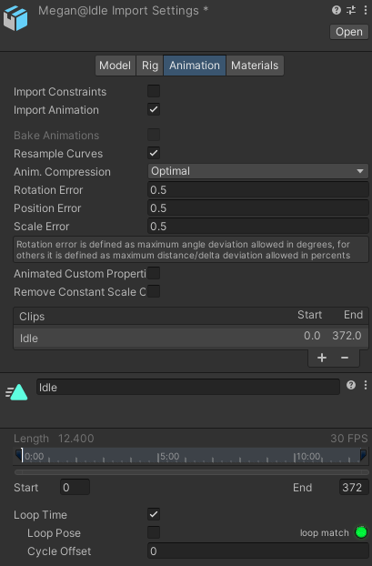

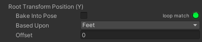

## Creating an animation controller

In `vr_assets_common/Objects/MovingObjects/Animators`, copy-paste the `HumanAnimTemplate` controller to a new one, for example `MeganAnim`. Then click on your new controller to edit it.

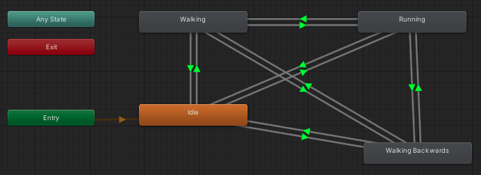

For each action (Idle, Walking, Running, Walking Backwards), click on the action box and select the Motion option in the inspector, and select the correct action for this character:

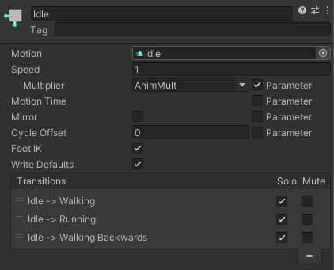

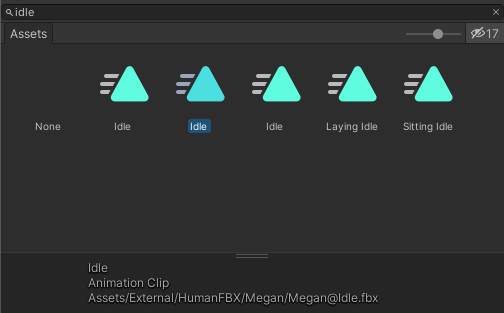

## Creating a new Human prefab

Drag and drop the `vr_assets_common/Objects/MovingObjects/Human` prefab to a scene.

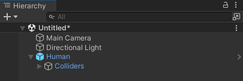

Drag and drop the model FBX, e.g., `External/HumanFBX/Megan/Megan.fbx` to the prefab in the scene. The FBX must be the first element, on top of every other elements:

In the inspector for the FBX that you just added, select the controller that you just created.

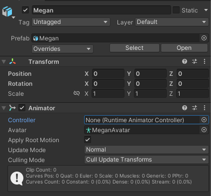

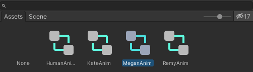

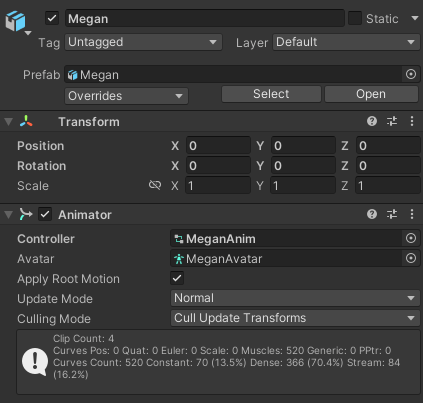

## Saving as a prefab variant

In the project, drag and drop the Human prefab in `vr_assets_common/Objects/MovingObjects` and save it as a **prefab variant**. Rename the prefab `HumanName`, for example `HumanMegan`. From now on, you have a new prefab named `HumanMegan` that you can use in every scene.
