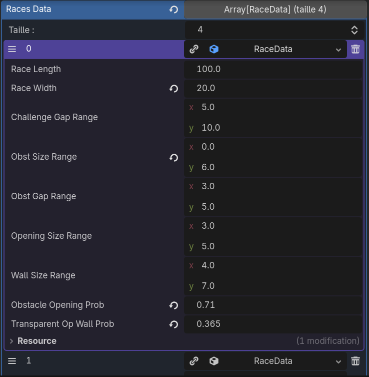
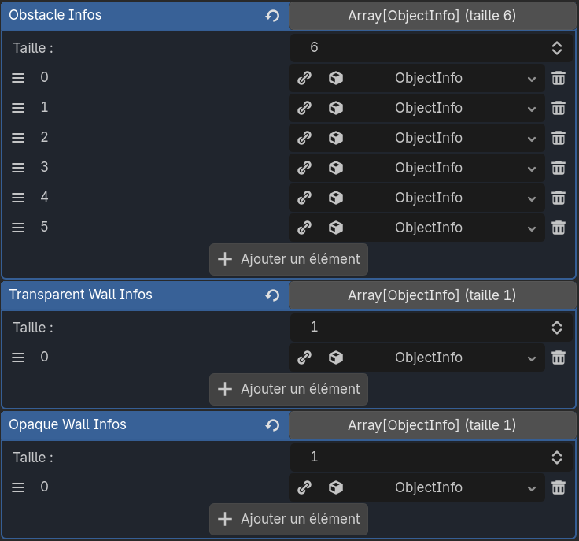
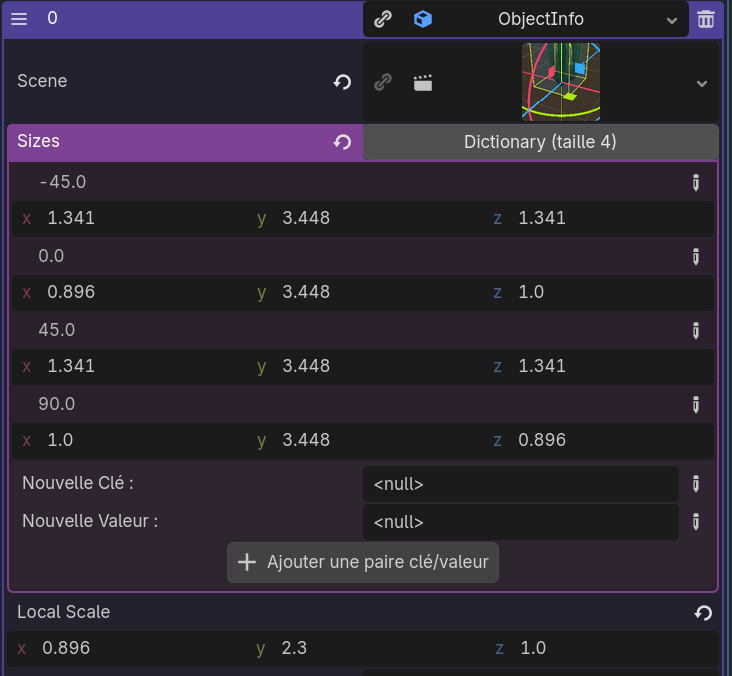

# Obstacle Race

## Parameters of an obstacle race
### Race data
The obstacle race is organized with different race levels. Every race level has parameters defined in a race_data object: 

*Screenshot of the inspector of obstacle_race_generator node*

*Every length is in meters*

A race is composed of challenges. A challenge is a line of different objects.
A challenge is defined by the space between its objects and the size of the objects.
Objects can be walls or obstacles. 
That is why there are parameters for obstacles:
- Size -> ***Obst Size Range***
- Space between obstacles -> ***Opening Size Range***

And for walls:
- Size -> ***Wall Size Range***
- Space between walls -> ***Opening Size Range***

The range corresponds of the minimum and the maximum of the lengths.

You can choose the proportion of walls or obstacles with the parameter ***Obstacle Opening Prob*** (1 for obstacle and 0 for opening).

Walls can be transparent or opaque (ex: brickwall or fence). You can choose the proportion with the parameter ***Transparent Op Wall Prob*** (1 for transparency and 0 for opacity).

These parameters can be edited in the inspector of the node obstacle_race_generator. 
###  Objects

In the same node (obstacle_race_generator), you need to fill the object fields to generate the objects. They are 3 lists:

- ***Obstacle Infos***
- ***Transparent Wall Infos***
- ***Opaque Wall Infos***

These are ressource objects called ObjectInfo. They are not the scenes of the objects directly. They contains differents fields:

- ***Scene***: References the scene, needed to instantiate the object.
- ***Sizes***: It's a dictionary of the sizes in the axis in function of the rotation of the object.
- ***Local Scale***: The size with the default rotation in the scene. 

The sizes is needed to calculate sizes without instantiate every object.
- the depth of the challenge (= the greatest value in x between the obstacles of the challenge)
- the object size (= the z value)

To get these object infos, we need to bake them before running the main scene.

##  How to bake objects
A tool script named object_size_baker.gd is used to create the ObjectInfo objects with the scenes.
#### First step
Every scene that you want to bake must be located in one and same folder.
Then, the folder path must be referenced in the baked_config_res.tres. 
This ressource is located in games/races/obstacle_race/generator/baker.
Finally, create a destination folder for the ObjectInfo objects and reference its path in baked_config_res.tres.

#### Second step
You can run the baker script: object_size_baker.gd located in games/races/obstacle_race/generator/baker.
How to run it: 
Open it and Ctrl+maj+x or right-clic + execute.

If it works, you have message in the console of the ObjectInfo files created with there paths. 

#### Third Step

The ObjectInfo objects are created. You now need to pass them in the inspector of the obstacle_race_generator node.
